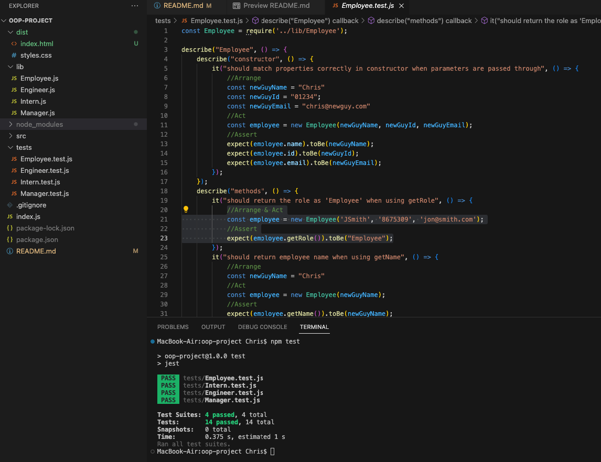
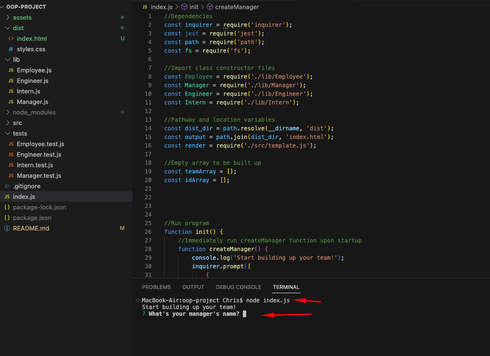
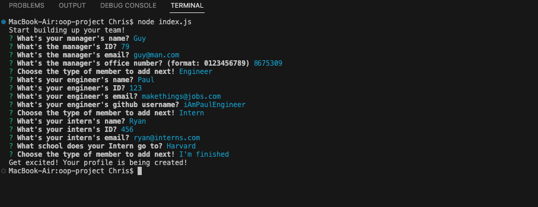
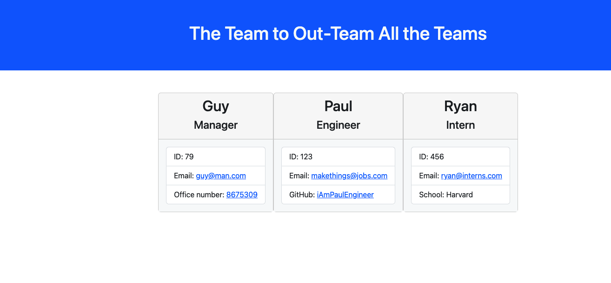

# **Staff My Team: Team Profile Generator**


Link to Github Repo: 
```
https://github.com/chrisgom113/staff-my-team
```
Link to walkthrough video:
``` 
https://drive.google.com/file/d/1asnIahywhXR5KmbPlOLegbBMUDpIrVIQ/view
```

# Description


This app uses object-oriented programming with node.js to delevop an program that builds team profiles based on command line prompt-input sequencing. The result is a newly-generated HTML page that manifests the inputted data into a user-readable format.

Similar to the previous challenge generate a README file, this challenge purported the same goal, however, the student was to create a layered structure of directories that all served unique functions to do the job. For example, student needed to create a separate folder to organize the different classes to be used and later imported. Additionally, another separate folder is used to store the corresponding files that contain code to "test" the classes code. This a much more sophisticated path of coding challenges because now there is a complicated structure of files that organize the logical basis of the end goal. Lastly, a separate javscript file needed to be created that used object-literals to plant the html code into the javascript functions (or vice versa).

We end up with an app that asks a series of questions related to the said team members, and then a resulting webpage that nicely displays profile cards.

```
Note: Sample HTML is in 'dist' folder
```


# Installation


Use 'npm i' to download the dependencies listed below:

```
Inquirer 8.2.4

Jest
```


# Usage

- **This walkthrough video demonstrates the functionality in real-time: https://drive.google.com/file/d/1asnIahywhXR5KmbPlOLegbBMUDpIrVIQ/view**

- **The below description and screenshots also demonstrate some of the program's back-end coding.**

## User is able to run jest testing to observe that all class coding passes tests.


  
## User invokes program by entering “node index.js” into the command line and is presented with questions.




## User enters each team member's name, email, id, and other characteristics depending on the type of role they play on the team. 




## Once finished, user sees a newly-generated HTML file in the dist folder of the repository.



# Tests

## Run:

```
npm test
```
 
# License

None
  